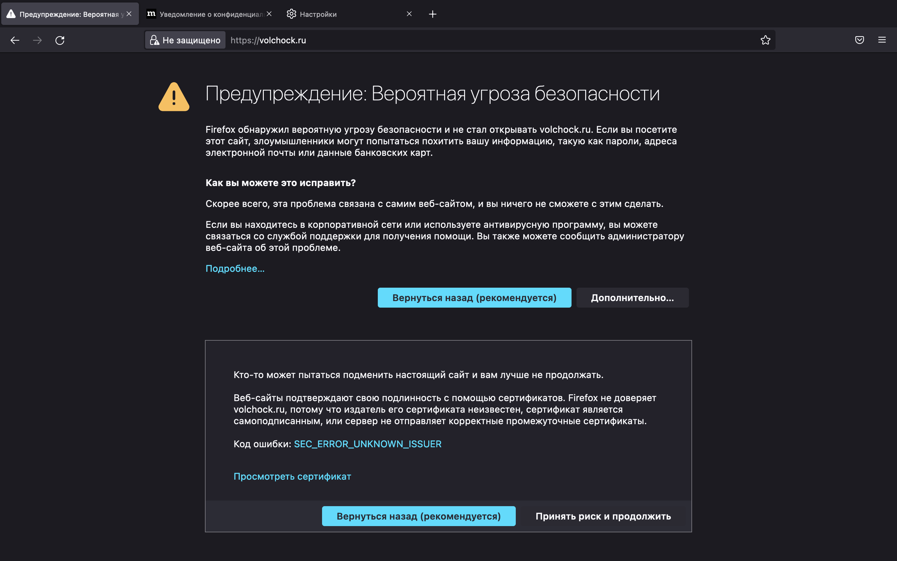
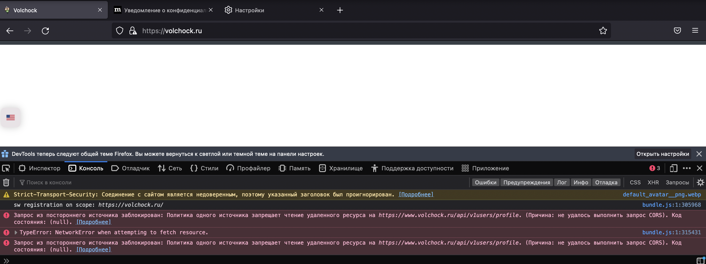

# Тестирование проекта "Volchock" команды Frontoвики

Ссылка на Jira: https://jira.vk.team/browse/VKEDU-5

Окружение:
macOS 12.2.1, 16 gb ОЗУ, экран 13,3-дюймовый (2560 × 1600) Google Chrome Версия 99.0.4844.51 (Официальная сборка), (arm64)

Для мобильной версии использовался режим отладки в Google Chrome с dimensions:
    - Samsung Galaxy s8+
    - Iphone 12 pro

А так же Iphone 13 pro с Safari на ios 15.3

Что у нас есть и на что стоит обратить внимание:

1. Общий ui/ux 
    * Общий грид карточек
        - продвижение выделяет карточки
        - использование адаптивной сетки
        - Баг: при нестандартных соотношениях экрана ширина карточек - разная
        
        - возможность удаления карточки в профиле при клике по крестику
        - возможность купить карточку в корзине
        - в мобильной версии кнопки и адрес располагаются вертикально, в десктопной - горизонтально
        - при наведении кусора на карточку он меняется на поинтер
        - Баг: для больших по размеру адресов и цен элементы вылазят за пределы карточки
        
    * Локализация
        - возможность изменить язык на любой странице сайта
        - локализован весь контент, кроме пользовательского и Яндекс.Карт.
        - автоматическое определение языка
        - обновление страницы сбрасывает локализацию
    * Хэдер
        * Кликабельное название сервиса
        * Поиск
            - полнотекстовый поиск по названию и описанию объявления
            - Баг в мобильной версии - неверный формат данных для любого ввода 
        * кнопка разместить объявление
        * кнопка `Войти` для неавторизованного пользователя открывает модальное окно (см. пункт 2)
        * выпадающее меню для авторизованного пользователя
    * Категории
        - на главной странице расположен блок категорий
        - при отсутствии товаров в категории - выдаем соответствующее сообщение
        - в категории могут быть товары, которые ей не соответствуют.
    * Роутинг
        - страница товара содержит путь категорий
        - профиль в навбаре содержит выпадающее меню с основными ссылками
        - страница профиля содержит все внутрипрофильные ссылки (корзина, настройки и т.д)
        - после создания объявления происходит редирект на предложение с платными услугами
        - кнопки 'разместить объявление', 'добавить в корзину', 'добавить в избранное' открывают окно авторизации/регистрации, если пользователь не авторизован

2. Регистрация и авторизация
    * Форма авторизации
        - валидация форм с подсказками
    * Форма регистрации
        - валидация форм с подсказками
        - Баг: нет валидации на максимальное число символов, это может сломать всю верстку на страницах товара, продавца и профиля
    * Модальное окно
        - открывается на любой странице.
        - не адаптировано под мобильные версии
            
        - неочевидное закрытие окна - нажатие на затемнение

3. Страница просмотра объявления
    * Общий вид
        - страница разделена на блоки: информация о товаре и дополнительная информация
        - интуитивное разделение информации в блоке горизонтальными линиями
        - счетчик просмотров увеличивается каждый раз при открытии страницы товара (кроме случаев когда страницу просматривает владелец товара)
    * Карусель с фотографиями
    * Блок с продавцом
        - основная информация о продавце (имя, фамилия, рейтинг, дата регистрации, аватар)
    * Добавление в корзину
        - требует авторизации
        - если атвор просматриваемого товара пользователь - редирект на профиль
        - если товар в корзине - редирект в корзину
    * Чат
        - требует авторизации
    * Графики изменения цены
        - представлен в виде гистограммы
        - Баг: нерепрезентативность графика при неизменной цене 
    * Карта с местоположением
        - по умолчанию скрыта
        - на карте указан маркер, проставленный продавцом

4. Страница продавца
    * Блок продавца
        - содержит основную информацию о продавце
        - рейтинг представлен в виде звезд (начальный рейтинг = 0)
    * Грид объявлений
        - содержит все активные объявления
    * Выставление оценки
        - звезды - кликабельны. Ставится оценка от 1 до 5
        - если пользователь оценен - присутствует соответствующее сообщение и оцененный рейтинг
        - изменить оценку нельзя

5. Страница добавления объявления
    - Кнопка редиректа в навбаре (десктоп).
    - В мобильной версии внизу на главной странице. При скроле вниз пропадает, при скроле вверх появляется.
    - Можно зайти, только если авторизован, иначе редирект на главную.
    * Формы и их валидация
        - Валидация названия. Ограничение на минимальное число символов. На максимальное - нет.
        - Категория выбирается сразу (одежда по умолчанию). Можно выбирать из предложенного списка.
        - Цена может быть равна 0 - будет отображаться 'по запросу'. Аналогичное поведение, при пустой строке.
        - Описание может быть пустым - никаких указаний на это нет. Нет валидации на максимальное число символов.
    * Добавление фотографий
        - Можно добавить несколько фотографии за один раз или по одной.
        - Нельзя добавить одинаковые фото подряд. Можно разделить их другой фотографией.
    * Добавления адреса
        - В самом инпуте есть подсказка, что необходимо использовать карту, но инпут все равно активен.
        - На карте можно выбирать место сделки. Замена метки при последующих кликах.
        - Адрес местоположения переносится в инпут.
        - Если написать адрес в инпут без клика по карте, валидация все равно будет не пройдена.

6. Страница редактирования объявления
    - Если зайти на свое объявление, то вместо кнопок добавить в корзину и написать продавцу будет кнопка редактировать.
    - 'Добавить в избранное' заменяется на 'Ваше объявление'. Ведет на страницу всех объявлений. Небольшой баг - при наведении на эту кнопку, она некорректно подсвечивается. 
    - При нажатии на кнопку 'редактировать' редирект на страницу редактирования, идентична странице создания объявления, только инпуты уже заполнены.
    * Снова формы и валидация
        - Валидация аналогична странице нового объявления.
    * Корректная обработка изменения фотографий
        - Можно удалить любую старую фотографию и добавить новую.
        - Можно удалить все фотографии - тогда выставляется картинка по умолчанию.
        - Если цена была 'по запросу' - в форме цены '0'.
        - Текст 'Нет описания' в форме описания.

7. Профиль
    1. Меню навигации
       - Находится левее основного контента и видно на любой странице профиля
       - Содержит информацию о имени, рейтинге, аватар
       - 6 кнопок для навигации по страницам профиля, каждая при наведении подсвечивается
    2. Страница объявлений
        - Основная страница профиля. Большинство редиректов перенаправляют на нее.
        - Если какая то из категорий пуста, то отображается специальная подсказка и картинка.
        * Просмотр
            - Сетка товаров аналогичная сетке на главной странице.
            - Есть 3 кнопки - показывать активные объявления, показывать объявления в архиве и кнопка удаления.
            - У активных объявлений клик редиректит на их страницу, у архивных - нет.
        * Удаление
            - При нажатии кнопки удалить она подсвечивается и у всех активных объявлений появляется красный крестик в верхнем правом углу.
            - При нажатии на этот крестик появляется небольшое модальное окно с вопросом о причине удаления (два варианта ответа: 'продал на волчке' и 'другая причина').
            - В случае выбора 'другой причины' объявление полностью удаляется.
            - Модальное окно можно закрыть кликнув вне его области или нажать на крестик.
        * Добавление в архив
            - В случае выбора 'продал на волчке' объявление попадает в архив.
            - Архивные объявления отображаются в отдельной вкладке в профиле.
    3. Избранное
        - Все объявления, которые пользователь добавляет 'в избранное' попадают на эту вкладку.
        - Если нет объявлений, то отображается картинка 'в избранном ничего нет'.
        - Удаление аналогично удалению объявлений из профиля, только без модального окна с подтверждением.
        - Можно попасть как из выпадающего меню навбара, так и из страницы объявления, которое уже в избранном.
    4. Корзина
        - Функционал похож на избранное с одним важным отличием - у всех объявлений есть кнопка 'купить', при нажатии на которую отображается подробная контактная информация продавца (телефон, если он был указан и email).
    5. Чат
        - Список всех диалогов с аватарами товара, его названием и именем продавца.
        - Чат создается на основе объявления - т.е. с одним человеком может быть несколько чатов.
        - Новый чат создается через страницу объявления.
        - Сообщения приходят в реальном времени.
        - Есть дата в формате день, месяц, год которая отображается в ленте. Каждое сообщение также имеет время отправки.
    6. Платные услуги
        - Сетка активных объявлений, при клике на какое-либо объявление попадаем на страницу продвижения.
        - На вкладку продвижения можно также попасть после создания объявления.
        - Три различных уровня с разной ценой, у каждого есть краткое описание, что он в себя включает.
        - При клике на 'оплатить' происходит редирект в сервис 'Юмани'.
        - Спустя небольшое время после оформления покупки, уровень объявления 'повышается'.
        - Баг: после оплаты третьего уровня продвижения ничего не происходит, в то время как у двух других уровней происходит улучшение объявления 
    7. Настройки
        - Можно изменить аватар нажав на специальный инпут в виде фотоаппарат, но при наведении на этот инпут курсор не меняется.
        - Изменение пароля происходит через специальную форму, для этого нужно ввести старый пароль и новый, новый должен удовлетворять требованиям создания пароля.
        - В случае если новый пароль не удовлетворяет требованиям, выводится подсказка, что пароль слишком простой.
        - Есть проверка старого пароля.
        - Если пароли совпадают, то инпут отображается как некорректный, при этом в подсказке написано, что новый пароль слишком простой.
        - В отдельной форме можно изменить личные данные (имя, фамилия, телефон), также есть неактивный инпут с почтой.
        - Если телефон неверного формата (длина меньше 11 символов), то при нажатии на кнопку ничего не происходит.
        - При успешном изменение данных все инпуты становятся зелеными, и текст кнопки меняется на 'информация сохранена'.
        - Баг: если поменять имя, и написать телефон неверного формата, то форма отреагирует как будто все корректно, при этом имя сохранится, а телефон нет. 

## Кроссбраузерность:
Firefox Версия 98.0.1 (64-битная)

- При открытии сайта появляется следующее оповещение: 
- Сайт не функционирует корректно - запросы, не отправляются из за ошибок CORS 

Safari Версия 15.3 (17612.4.9.1.8)
- Сайт функционирует аналогично Google Chrome и все проверки выше справедливы и для Safari.