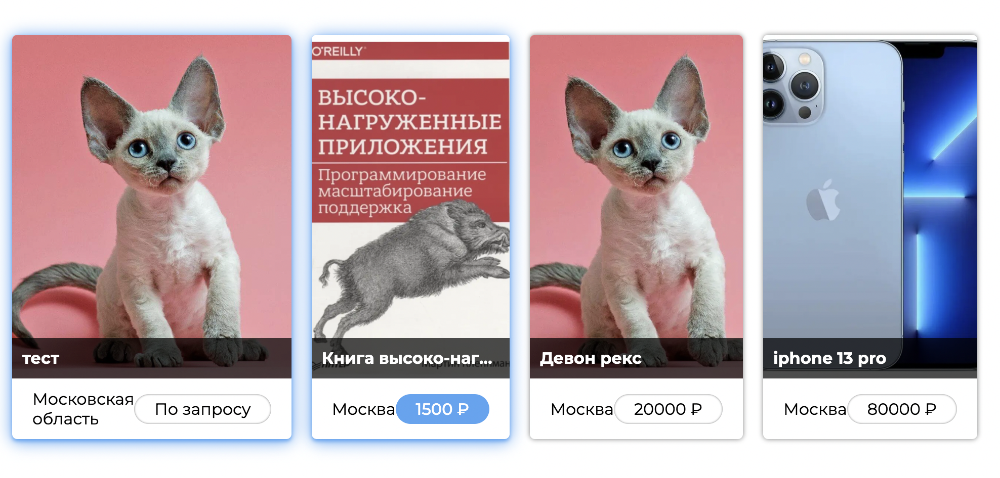
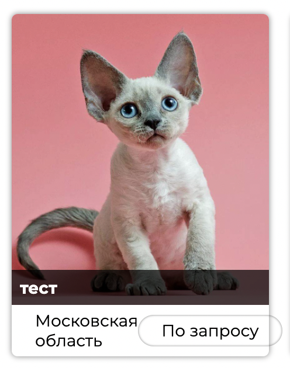
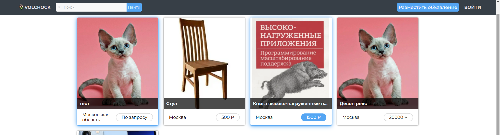
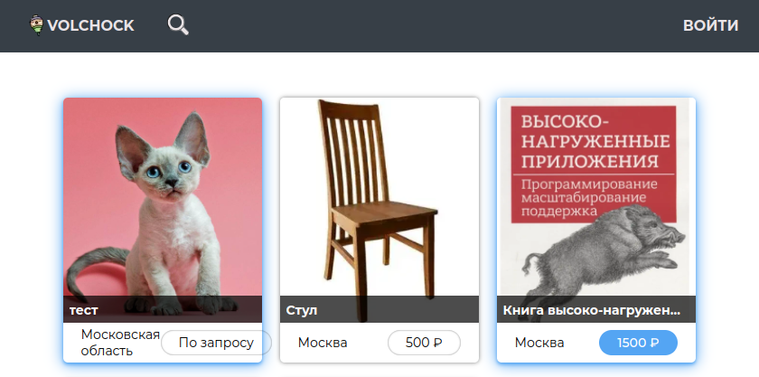
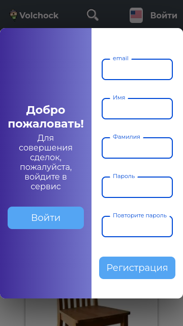
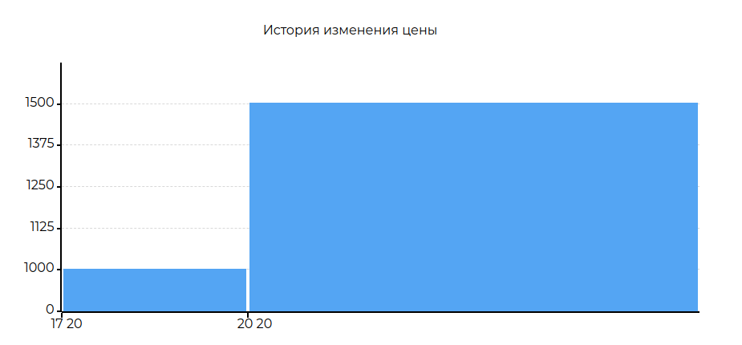
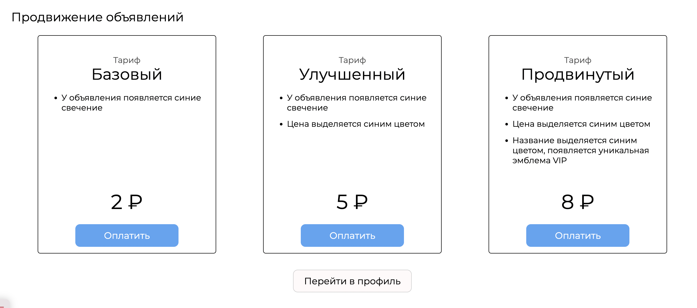
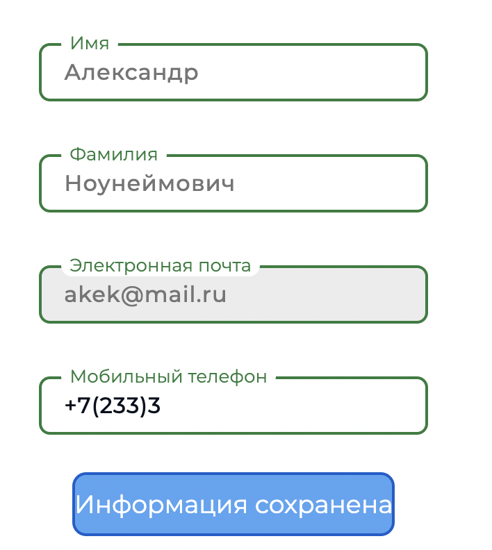

# Тестирование проекта "Vochock" команды Frontoвики

Что у нас есть и на что стоит обратить внимание:

1. Общий ui/ux 
    * Общий грид карточек
        - Три разных уровня продвижения объявлений - такие объявления выделяются на фоне остальных.
        - Сетки карточек используются в нескольких местах приложения - профиль, главная, поиск, категории, корзина, избранное
        - Сетка масштабируется при любой ширине экрана.
        - Баг: При нестандартных соотношениях экрана ширина некоторых карточек будет меньше, чем у других в одном ряду.
        
        - В профиле есть возможность удалить элементы сетки - к каждой карточке добавляется кнопка удаления
        - В корзине есть возможность получить контактную информацию продавца - у каждой карточки есть кнопка купить.
        - В мобильной версии кнопки и адрес располагаются вертикально, в десктопной - горизонтально.
        - Баг: Из за горизонтального расположения, если цена и адрес достаточно большие, то элементы могут 'вылезти' за пределы карточки.
        
    * Локализация
        - Кнопка смены языка есть на всех страницах.
        - Переводит весь текст на всех страницах, кроме пользовательского(имена, объявления, их описание) текста и сервиса Яндекс.Карты.
        - В зависимости от языка в настройках браузера, автоматически ставится русский или английский язык.
        - При обновлении страницы язык сбрасывается (см. предыдущий пункт).
        - Некоторые элементы заметно меняют свой размер (пример: кнопка - разместить объявление, new advert)
    * Хэдер
        * Кликабельный логотип сервиса
        * Поиск
            - В десктопной версии поисковая строка в навбаре, в мобильной - кнопка, которая вызывает инпут.
            - В мобильной версии можно заметить, что инпут занимает не все пространство и видна кнопка смены языка 
            - Поиск ищет вхождения слов как в названии, так в описании объявления.
            - В случае опечаток и грамматических ошибок поиск не работает.
            - Баг в мобильной версии - на любой инпут пишет, что данные неверного формата 
        * Кнопка разместить объявление
            - При нажатии перенаправляет на страницу создания объявления
            - Баг: при небольшом размере экрана кнопка пропадает и невозможно перейти на страницу создания объявления  
        * Кнопка `Войти` для неавторизованного пользователя
        * Выпадающее меню для авторизованного пользователя
    * Категории
        - На главной странице расположен блок категорий, для быстрого поиска товара в конкретной категории.
        - Если товаров в данной категории нет, то будет соответсвующая надпись на странице категории.
        - Перейти по категории можно со страницы товара.
        - Корректно меняются на английский язык.
        - Нет никакой премодерации, поэтому в категории могут быть товары, которые ей не соответствуют.
    * Роутинг
        - Нажатие на название "volchock" в навбаре всегда ведет на главную страницу.
        - На странице каждого товара есть 'путь', который можно использовать, для возврата на главную или перехода на страницу категории.
        - На страницу продавца можно перейти нажав на его аватарку или выделенное имя на странице товара.
        - Нажав на профиль, в навбаре появляется выпадающее меню с основными ссылками.
        - На самой странице профиля располагаются кнопки с переходом во все вкладки связанные с функционалом профиля
        - После создания объявления происходит редирект на предложение с платными услугами.
        - После редактирования объявления, происходит редирект на страницу этого объявления.
        - Кнопки 'разместить объявление', 'добавить в корзину', 'добавить в избранное' открывают окно авторизации/регистрации, если пользователь незалогинен. 

2. Регистрация и авторизация
    * Форма авторизации
        - Обратывается пустой инпут почты в авторизации.
        - Если email не корректен, то подсказка говорит, что 'Такого пользователя не существует'.
        - Если пароль меньше определенной длины, то просто пишет, что пароль неверный.
        - Если email и пароль проходят валидацию, но такого пользователя действительно нет, надпись 'Такого пользователя не существует'.
        - Если пароль неверный, то подсказка говорит, что 'Неверный пароль'.
    * Форма регистрации
        - Обратываются пустые инпуты, но при этом инпут повторите пароль ведет себя как корректный инпут. 
        - Есть валидация формата email.
        - Есть подсказка, что имя или фамилия должны быть без спецсимволов, но нет подсказки, что они должны быть также от 2-х символов.
        - Подсказка, что пользователь уже существует, в случае если email уже зарегистрирован.
    * Модальное окно
        - Открывается на любой странице.
        - Выглядит 'растянуто' в мобильной версии.
        - Лейблы инпутов слишком маленькие в мобильной версии.
        - Анимация для переходов между регистрацией и авторизацией.
        - Нет никакого явного элемента для закрытия окна - только нажатие вне этого окна.
        - Минор мобильной версии: на маленьких экранах модальное окно занимает все место и выглядит *не очень* 

3. Страница просмотра объявления
    * Общий вид
        - Два блока информации: блок информации о товаре и блок дополнительной информации.
        - Логическое разделение блоков информации горизонтальными линиями: адрес сделки и состояние товара, информация о товаре, прочая информация.
        - Счетчик просмотров увеличивается с каждым обновлением страницы, если это не делает авторизованный владелец этого объявления.
    * Карусель с фотографиями
        - Возможность выбрать какую-либо конкретную фотографию, либо переключать их последовательно.
    * Блок с продавцом
        - Краткая информация о продавце (имя, фамилия, рейтинг, дата регистрации, аватар).
        - Ссылка на профиль продавца.
    * Кнопка чата и кнопка добавить в корзину
        - Можно добавить в корзине/избранное.
        - Если пользователь незалогинен, открывается окно регистрации/логина.
        - Если объявление принадлежит пользователю, кнопки изменяются и ведут на его профиль.
        - Если товар уже в избранном/корзине, то кнопка редиректят в избранное/корзину.
    * Графики изменения цены
        - Гистограммы цен в различные промежутки времени.
        - Появляются только если цена менялась.
        - Минор: если цена долго не изменялась, то график нерепрезентативен 
    * Карта с местоположением
        - По умолчанию скрыта.
        - На карте указан маркер продавца, который он указал при создании объявления.

4. Страница продавца
    - Отображается имя, фамилия, рейтинг, дата регистрации, аватар.
    - Отображается только имя, хотя на странице объявления отображается и имя и фамилия.
    - Рейтинг представляет собой 5 звезд, часть из которых заполнены в зависимости от рейтинга.
    - По умолчанию рейтинг 0.
    * Грид объявлений
        - Отображаются все активные объявления данного продавца, в них можно перейти.
    * Выставление оценки
        - При наведении на рейтинг в виде звезд они подсвечиваются, кликом можно поставить от 1 до 5 звезд.
        - После этого будет надпись, что пользователь оценен на выбранную оценку.
    * Отображение, что оценка уже выставлена
        - Изменить оценку нельзя.
        - Так же будет надпись на сколько пользователь его оценил.

5. Страница добавления объявления
    - Кнопка находится в навбаре в десктоп версии.
    - В мобильной версии кнопка находится внизу на главной странице. При скроле вниз она пропадает, при скроле вверх появляется.
    - Можно зайти, только если авторизован, иначе будет редирект на главную.
    * Формы и их валидация
        - Валидация названия.
        - Категория выбирается сразу (одежда по умолчанию), ее можно не заметить.
        - Цена может быть равна 0 - такие объявления указываются как 'по запросу', но в форме цены будет пустая строка и она пройдет валидацию.
        - Описание может быть пустым - никаких указаний на это нет.
    * Добавление фотографий
        - Можно добавить все фотографии за один раз.
        - Можно добавлять несколько фотографий разными инпутами.
    * Добавления адреса
        - Есть инпут для адреса, но в нем нет подсказок при вводе адреса.
        - В самом инпуте есть подсказка, что необходимо использовать карту, но инпут все равно активен.
        - На карте можно выбирать место сделки. Если место уже выбрано, то при последующем клике на карту произойдет замена.
        - Адрес местоположения переносится в инпут.
        - Даже если написать адрес в инпут без клика по карте, то все равно будет надпись, что адрес неверен.

6. Страница редактирования объявления
    - Если зайти на свое объявление, то вместо кнопок добавить в корзину и написать продавцу будет кнопка редактировать.
    - Вместо кнопки добавить в избранное будет кнопка 'Ваше объявление', которая ведет на страницу всех объявлений. Небольшой баг - при наведении на эту кнопку, она некорректно подсвечивается. 
    - При нажатии на кнопку 'редактировать' просходит редирект на страницу редактирования, она выглядит идентично странице создания объявления, только инпуты уже заполнены.
    * Снова формы и валидация
        - Валидация аналогична странице нового объвления.
    * Корректная обработка изменения фотографий
        - Можно удалить любую старую фотографию и добавить новую.
        - Можно удалить все фотографии - тогда выставится картинка по умолчанию.

7. Профиль
    1. Страница объявлений
        - Основная страница профиля. Большинство редиректов перенаправляют на нее.
        - Если какая то из категорий пуста, то отображется специальная подсказка и картинка, что активных/архивных объвлений нет.
        * Просмотр
            - Представляет собой сетку товаров, похожую на сетку на главной странице.
            - Есть 3 кнопки - показывать активные объявления, показывать объявления в архиве и кнопка удаления.
            - У активных объявлений можно по клику перейти на их страниц, у объявлений в архиве - нельзя.
        * Удаление
            - При нажатии кнопки удалить она подсвечивается и у всех активных объявлений появляется красный крестик в верхнем правом углу.
            - При нажатии на этот крестик появляется небольшое модальное окно с вопросом о причине удаления (два варианта ответа: 'продал на волчке' и 'другая причина').
            - В случае выбора 'другой причины' объявление полностью удаляется.
            - Модальное окно можно закрыть кликнув вне его области или нажать на крестик.
        * Добавление в архив
            - В случае выбора 'продал на волчке' объявление попадает в архив.
            - Архивные объявления отображаются в отдельной вкладке в профиле, но на страницу этого объявления перейти нельзя.
    2. Избранное
        - Все объявления, которые пользователь добавляет 'в избранное' попадают на эту вкладку.
        - Если нет объявлений, то отображается картинка 'в избранном ничего нет'.
        - Удаление аналогично удалению объявлений из профиля, только без модального окна с подтверждением.
        - Можно попасть как из выпадающего меню навбара, так и из страницы объявления, которое уже в избранном.
    3. Корзина
        - Функционал похож на избранное с одним важным отличием - у всех объявлений есть кнопка 'купить', при нажатии на которую отображается подробная контактная информация продавца (телефон, если он был указан и email).
    4. Чат
        - Список всех диалогов с аватарами товара, его названием и именем продавца.
        - Чат создается на основе объявления - т.е. с одним человеком может быть несколько чатов.
        - Новый чат создается через страницу объявления.
        - Сообщения приходят в реальном времени.
        - Есть дата в формате день, месяц, год которая отображается в ленте. Каждое сообщение также имеет время отправки.
    6. Платные услуги
        - Сетка активных объявлений, при клике на какое-либо объявление попадаем на страницу продвижения.
        - На вкладку продвижения можно также попасть после создания объявления.
        - Три различных уровня с разной ценой, у каждого есть краткое описание, что он в себя включает.
        - При клике на 'оплатить' происходит редирект в сервис 'Юмани'.
        - Спустя небольшое время после оформления покупки, уровень объявления 'повышается'.
        - Баг: после оплаты третьего уровня продвижения ничего не происходит, в то время как у двух других уровней происходит улучшение объявления 
    7. Настройки
        - Можно изменить аватар нажав на специальный инпут в виде фотоаппарат, но при наведении на этот инпут курсор не меняется.
        - Изменение пароля происходит через специальную форму, для этого нужно ввести старый пароль и новый, новый должен удовлетворять требованиям создания пароля.
        - В случае если новый пароль не удовлетворяет требованиям, выводится подсказка, что пароль слишком простой.
        - Есть проверка старого пароля.
        - Если пароли совпадают, то инпут отображается как некорректный, при этом в подсказке написано, что новый пароль слишком простой.
        - В отдельной форме можно изменить личные данные (имя, фамилия, телефон), также есть неактивный инпут с почтой.
        - Если телефон неверного формата (длина меньше 11 символов), то при нажатии на кнопку ничего не происходит.
        - При успешном изменение данных все инпуты становятся зелеными, и текст кнопки меняется на 'информация сохранена'.
        - Баг: если поменять имя, и написать телефон неверного формата, то форма отрегирует как будто все корректно, при этом имя сохранится, а телефон нет. 

