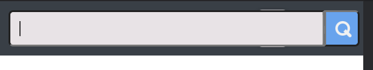

# Тестирование проекта "Vochock" команды Frontoвики

Что у нас есть и на что стоит обратить внимание:

1. Общий ui/ux 
    * Верстка
    * Респонсив дезигн
    * Мобильная версия
    * Общий грид карточек
    * Локализация
        - Кнопка смены языка есть на всех страницах.
        - Переводит весь текст на всех страницах, кроме пользовательского(имена, объявления, их описание) и яндекс карт.
        - В зависимости от языка в настройках браузера, автоматически ставится русский или английский языки.
        - При перезагрузке страницы язык сбрасывается(см. предыдущий пункт).
        - Некоторые элементы заметно меняют свой размер(пример - кнопка разместить объявление, new advert)
    * Поиск
        - В десктопной версии поисковая строка в навбаре, в мобильной - кнопка, которая вызывает инпут.
        - Мобильной версии можно заметить, что инпут занимает не все пространство и видна кнопка смены языка 
        - Поиск ищет вхождения слов как в названии, так в описании объявления.
        - В случае опечаток и грамматических ошибок поиск не работает.
        - Баг в мобильной версии - на любой инпут пишет, что данные неверного формата 
    * Категории
        - На главной странице расположен блок категорий, для быстрого поиска товара в конкретной категории.
        - Если товаров в данной категории нет, то будет соответсвующая надпись на странице категории.
        - Перейти по категории можно со страницы товара.
        - Корректно меняются на английский язык.
        - Нет никакой премодерации, поэтому в категории могут быть товары, которые ей не соответствуют.
    * Роутинг
        - Нажатие на название "volchock" в навбаре всегда ведет на главную страницу.
        - На странице каждого товара есть 'путь', который можно использовать, для возврата на главную или перехода на страницу категории.
        - На страницу продавца можно перейти нажав на его аватарку или выделенное имя на странице товара.
        - Нажав на профиль, в навбаре появляется выпадающее меню с основными ссылками.
        - На самой странице профиля располагются кнопки с переходом во все вкладки связанные с функционалом профиля
        - После создания объявления происходит редирект на предложение с платными услугами.
        - После редактирования объявления, происходит редирект на страницу этого объявления.
        - Кнопки 'разместить объявление', 'добавить в корзину', 'добавить в избранное' открывают окно авторизации/регистрации, если пользователеь незалогинен 

2. Регистрация и авторизация
    * Форма авторизации
        - Обратывается пустой инпут почты в авторизации.
        - Если email не корректен, то подсказка говорит, что 'такого пользователя не существует'.
        - Если пароль меньше определенной длины, то просто пишет, что пароль неверный.
        - Если email и пароль проходят валидацию, но такого пользователя действительно нет, надпись 'такого пользователя не существует'.
        - Если пароль неверный надпись - 'Неверный пароль'
    * Форма регистрации
        - Обратываются пустые инпуты, но при этом инпут повторите пароль ведет себя как корректный инпут. 
        - Есть валидация формата email
        - Есть подсказка, что имя или фамилия должны быть без спецсимволов, но нет подсказки, что они должны быть также от 2-х символов
        - Подсказка, что пользователь уже существует в случае если email уже зарегистрирован.
    * Модальное окно
        - Открывается на любой странице.
        - Выглядит 'растянуто' в мобильной версии.
        - Лейблы инпутов слишком маленькие в мобильной версии.
        - Анимация для переходов между регистрацией и авторизацией.
        - Нет никакого явного элемента для закрытия окна - только нажатие вне этого окна.

3. Страница просмотра объявления
    * Общий вид
    * Слайдер с фотографиями
    * Блок с продавцом
    * Кнопка чата и кнопка добавить в корзину
    * Текст с описанием
    * Графики изменения цены
    * Карта с местоположением

4. Страница продавца
    - Отображается аватарка, имя, рейтинг и дата регистрации
    - Отображается только имя, хотя на странице объявления отображается и имя и фамилия.
    - Рейтинг представляет собой 5 звезд, часть из которых заполнены в зависимости от рейтинга.
    - По умолчанию рейтинг 0.
    * Грид объявлений
        - Отображаются все активные объявления данного продавца, в них можно перейти.
    * Выставление оценки
        - При наведении на рейтинг в виде звезд они подсвечиваются, кликом можно поставить от 1 до 5 звезд
        - После этого будет надпись, что пользователь оценен на какую-либу оценку.
    * Отображение, что оценка уже выставлена
        - Если мы когда-либо оценили продавца, то изменить оценку уже нельзя.
        - Так же будет надпись на сколько мы его оценили.

5. Страница добавления объявления
    * Формы и их валидация!!!
    * Добавление фотографий
    * Добавления адреса

6. Страница редактирования объявления
    * Снова формы и валидация
    * Корректная обработка изменения фотографий

7. Профиль
    1. Страница объявлений
        * Просмотр
        * Удаление
        * Добавление в архив
        * Завершенные и активные объявления
    2. Избранное
        * Просмотр
        * Удаление
    3. Корзина
        * Просмотр
        * Удаление
        * Оформление покупки
    4. Чат
        * Просмотр
        * Новый чат
        * Получение сообщений
        * Отображение даты
    6. Настройки
        * Формы и валидация
    7. Платные услуги
        * Оформление покупки разных типов
        * Работает как после создания нового, так и для старых объявлений

